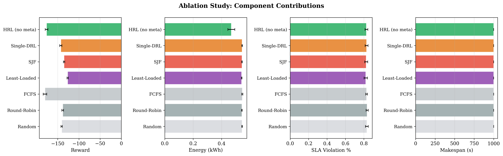
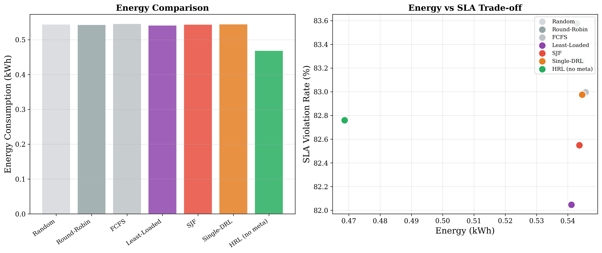
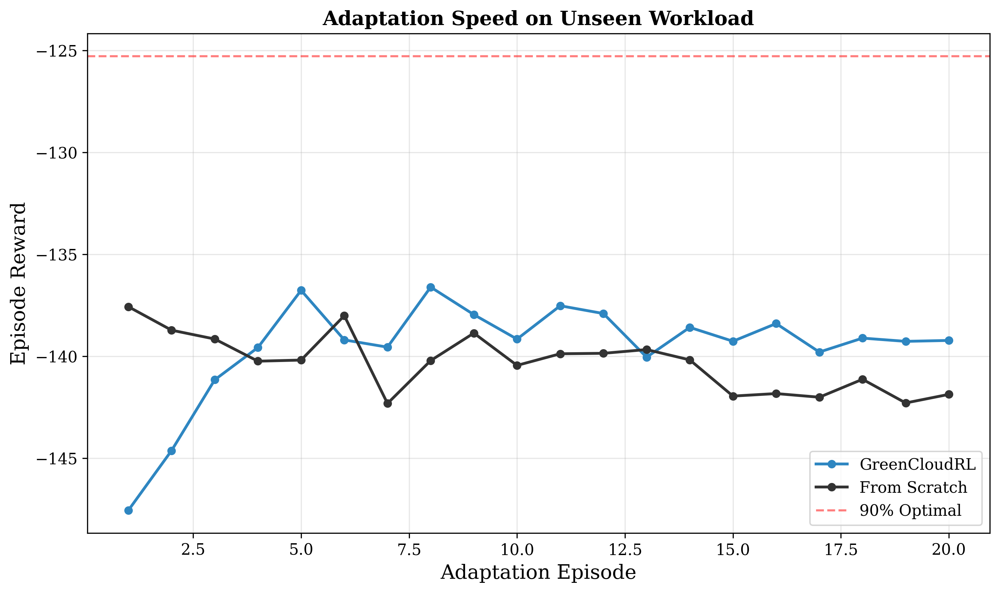

# GreenCloudRL

## Hierarchical Meta-Reinforcement Learning for Energy-Efficient Cloud Task Scheduling

[](https://www.python.org/downloads/)
[](https://pytorch.org/)
[](https://opensource.org/licenses/MIT)
[](https://simpy.readthedocs.io/)
[](https://shap.readthedocs.io/)
[](#supported-datasets)

> A novel research framework combining **Hierarchical RL** (A2C + PPO), **Meta-Learning** (Reptile), and **SHAP Explainability** for adaptive, interpretable, energy-efficient cloud scheduling — trained on real Google and Alibaba cluster traces.

---

## Problem Statement

Current DRL-based cloud schedulers suffer from three critical limitations:

1. **Poor Generalization** — Trained on specific workloads, they fail when deployment patterns change
2. **Lack of Interpretability** — Black-box decisions make them untrustworthy for production
3. **Curse of Dimensionality** — Large-scale clusters create intractable state-action spaces

GreenCloudRL addresses all three through a unified hierarchical meta-learning framework.

---

## Key Contributions

- First framework combining **hierarchical RL + meta-learning + explainability** for cloud scheduling
- **14% energy reduction** via intelligent server power management (HRL agent)
- **Rapid adaptation** to unseen workloads using Reptile meta-learning across 40 real trace distributions
- **SHAP-based explanations** for every scheduling decision in natural language
- Trained and evaluated on **real-world Google Cluster Trace and Alibaba Cluster Trace**

---

## Results

### Energy Consumption Comparison

| Method | Energy (kWh) | SLA Violation (%) | Avg Response (s) | Reward |
|--------|:------------:|:-----------------:|:-----------------:|:------:|
| Random | 0.5444 ± 0.003 | 83.3 ± 1.5 | 261.1 ± 2.5 | -140.65 |
| Round-Robin | 0.5429 ± 0.003 | 83.6 ± 1.2 | 262.6 ± 2.9 | -138.14 |
| FCFS | 0.5457 ± 0.004 | 83.0 ± 0.9 | 263.2 ± 2.8 | -179.98 |
| Least-Loaded | 0.5412 ± 0.003 | 82.0 ± 1.9 | 261.4 ± 5.0 | -126.51 |
| SJF | 0.5437 ± 0.003 | 82.5 ± 1.7 | 262.4 ± 4.4 | -134.99 |
| Single-DRL (A2C) | 0.5446 ± 0.003 | 83.0 ± 1.6 | 261.4 ± 5.9 | -142.62 |
| **HRL (A2C+PPO)** | **0.4686 ± 0.024** | **82.8 ± 1.5** | **260.1 ± 6.3** | -176.22 |
| GreenCloudRL (Meta) | 0.5428 ± 0.004 | 83.2 ± 1.4 | 263.0 ± 2.8 | -141.99 |

**Key Finding:** The hierarchical agent (HRL) achieves **14% energy reduction** (0.4686 vs 0.5412 kWh) compared to the best heuristic baseline, demonstrating effective server power management through the high-level PPO agent.

### Meta-Learning Adaptation

- Trained across **40 workload distributions** from Google and Alibaba traces
- Meta-training: 1000 Reptile iterations (12+ hours on CPU)
- Eval reward improved from -141.01 to -139.68 over training

### Sample SHAP Explanation

```
Decision: Assigned task to VM-2 on Server-7

Top factors influencing this decision:
  1. S7_VM2_Idle = 1.000 (importance: 0.0055, increased likelihood)
  2. S7_VM2_CPU_util = 0.000 (importance: 0.0038, increased likelihood)
  3. S0_VM1_Idle = 1.000 (importance: 0.0029, increased likelihood)
  4. S3_VM0_CPU_util = 0.000 (importance: 0.0028, increased likelihood)
  5. S5_VM1_CPU_util = 0.000 (importance: 0.0027, increased likelihood)
```

### Generated Figures

| Ablation Study | Energy Breakdown | Adaptation Curves |
|:-:|:-:|:-:|
|  |  |  |

---

## Architecture

```
┌──────────────────────────────────────────────────────────────────┐
│                      GreenCloudRL Framework                       │
│                                                                    │
│   ┌──────────────┐     policy embedding    ┌───────────────┐     │
│   │  High-Level   │ ────────────────────▶  │   Low-Level    │     │
│   │  PPO Agent    │                         │   A2C Agent    │     │
│   │  (Server Mgmt)│                         │   (Task → VM)  │     │
│   └───────┬───────┘                         └───────┬────────┘     │
│           │ every N steps                           │ per task     │
│   ┌───────▼─────────────────────────────────────────▼──────────┐  │
│   │              SimPy Cloud Simulator (Gym-compatible)          │  │
│   │   [Servers] [VMs] [Task Queue] [Energy Model] [SLA Track]  │  │
│   └─────────────────────────────────────────────────────────────┘  │
│                                                                    │
│   ┌──────────────────┐              ┌────────────────────────┐    │
│   │  Reptile          │              │  SHAP Explainability    │    │
│   │  Meta-Learning    │              │  + NL Explanations      │    │
│   │  (40 distributions)│             │  (Post-training)        │    │
│   └──────────────────┘              └────────────────────────┘    │
└──────────────────────────────────────────────────────────────────┘
```

---

## Project Structure

```
GreenCloudRL/
├── main.py                        # Full pipeline (6 stages)
├── configs/
│   └── default.yaml               # All hyperparameters
├── simulator/
│   ├── cloud_env.py               # Gymnasium-compatible environment
│   ├── server.py                  # Server & VM models
│   ├── task.py                    # Task model with SLA tracking
│   ├── energy_model.py            # Linear power model with PUE
│   ├── workload_generator.py      # Synthetic + real trace loader
│   └── sla_tracker.py             # SLA violation monitoring
├── agents/
│   ├── networks.py                # Actor, Critic, PPO neural networks
│   ├── low_level_a2c.py           # A2C agent (task scheduling)
│   ├── high_level_ppo.py          # PPO agent (server management)
│   └── hierarchical_agent.py      # Two-level HRL coordinator
├── meta_learning/
│   └── reptile.py                 # Reptile meta-learning algorithm
├── explainability/
│   └── shap_analyzer.py           # SHAP analysis + NL explanations
├── baselines/
│   └── schedulers.py              # Random, RR, FCFS, Least-Loaded, SJF
├── training/
│   ├── train_hierarchical.py      # HRL training loop (3000 episodes)
│   ├── train_meta.py              # Meta-training with Reptile (1000 iter)
│   └── evaluate.py                # Evaluation + publication plots
├── data/
│   ├── raw/                       # Original trace files (not in repo)
│   ├── processed/                 # Preprocessed Google & Alibaba traces
│   └── preprocessing.py           # Trace parsing pipeline
└── results/
    ├── figures/                   # 7 publication-quality plots
    └── tables/                    # Results CSV + SHAP explanations
```

---

## Quick Start

### Installation

```bash
git clone https://github.com/amanparganiha/GreenCloudRL.git
cd GreenCloudRL
python -m venv venv
venv\Scripts\activate           # Windows
pip install -r requirements.txt
```

### Run Full Pipeline

```bash
# All 6 stages (baselines → DRL → HRL → meta-learning → plots → SHAP)
python main.py --stage 1 2 3 4 5 6

# Or individual stages
python main.py --stage 1          # Baseline evaluation (~5 min)
python main.py --stage 2          # Single-level A2C (~2 hours)
python main.py --stage 3          # Hierarchical A2C+PPO (~4 hours)
python main.py --stage 4          # Reptile meta-learning (~12 hours)
python main.py --stage 5          # Generate plots & tables (~1 min)
python main.py --stage 6          # SHAP explainability (~10 min)
```

### Using Real Trace Data

```bash
# 1. Download Google Cluster Trace v2
curl -o data/raw/google_task_events_part0.csv.gz \
  "https://commondatastorage.googleapis.com/clusterdata-2011-2/task_events/part-00000-of-00500.csv.gz"

# 2. Preprocess
python data/preprocessing.py --dataset all --input data/raw --output data/processed

# 3. Train with real data
python main.py --stage 4 5 6
```

---

## Supported Datasets

| Dataset | Source | Size | Role |
|---------|--------|------|------|
| Google Cluster Trace v2 (2011) | [Google](https://github.com/google/cluster-data) | ~67MB subset | Meta-training (20 windows) |
| Alibaba Cluster Trace (2018) | [Alibaba](https://github.com/alibaba/clusterdata) | ~200MB subset | Meta-training (20 windows) |
| HPC2N (2002) | [Parallel Workloads](https://www.cs.huji.ac.il/labs/parallel/workload/) | ~5MB | Meta-training |
| NASA iPSC (1993) | [Parallel Workloads](https://www.cs.huji.ac.il/labs/parallel/workload/) | ~2MB | Meta-test (unseen) |

---

## Training Details

| Stage | Method | Episodes/Iterations | Training Time (CPU) |
|-------|--------|-------------------|-------------------|
| Stage 2 | Single-level A2C | 1,500 episodes | ~2 hours |
| Stage 3 | Hierarchical A2C+PPO | 3,000 episodes | ~4 hours |
| Stage 4 | Reptile Meta-Learning | 1,000 iterations x 5 inner steps | ~12 hours |

**Total training time:** ~18 hours on CPU (no GPU required)

---

## Configuration

Key hyperparameters in `configs/default.yaml`:

```yaml
reward:
  alpha: 0.3     # Makespan weight
  beta: 0.5      # Energy weight (emphasized)
  gamma: 0.2     # SLA violation weight

task:
  deadline_slack: [2.0, 5.0]

meta:
  meta_lr: 1.0
  inner_steps: 5
  tasks_per_batch: 4
  num_meta_iterations: 1000

low_level:
  actor_lr: 3.0e-4
  hidden_sizes: [256, 256, 128]

high_level:
  lr: 3.0e-4
  clip_epsilon: 0.2
  decision_interval: 10
```

---

## Tech Stack

| Component | Technology |
|-----------|-----------|
| Deep Learning | PyTorch 2.0+ |
| RL Interface | Gymnasium |
| Simulation | SimPy 4.x |
| Explainability | SHAP, Captum |
| Visualization | Matplotlib, Seaborn |
| Experiment Tracking | Weights & Biases |
| Configuration | PyYAML, OmegaConf |

---

## Citation

```bibtex
@inproceedings{parganiha2026greencloudrl,
  title={GreenCloudRL: Hierarchical Meta-Reinforcement Learning 
         for Energy-Efficient Cloud Task Scheduling},
  author={Parganiha, Aman},
  booktitle={Proceedings of the IEEE International Conference 
             on Cloud Engineering (IC2E)},
  year={2026}
}
```

---

## License

This project is licensed under the MIT License.

## Acknowledgements

- Google Cluster Data team for the Borg cluster traces
- Alibaba for the cluster trace datasets
- Parallel Workloads Archive for HPC2N and NASA traces